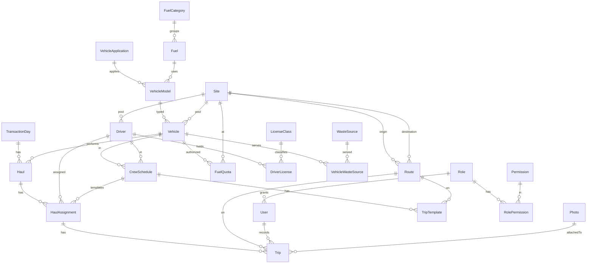

# 02 — Domain Model

This document describes the business entities, the transaction lifecycle, the state machines, and
the business rules — grounded in the legacy schema and controllers. Names follow
[`01-glossary.md`](./01-glossary.md).

## 1. The big picture — a truck's day

A vehicle's daily journey is modeled as a sequence of **trips** (legs), classified by
`RouteCategory`:

```
DEPART_POOL → REFUEL → PICKUP (TPS) → DISPOSAL (TPA, weighed) → [PICKUP → DISPOSAL]* → RETURN_POOL
```

The system records, per trip, the **target** (planned, from the schedule) and the **actual**
(realized) time, odometer, weights and fuel. Tonnage and fuel reporting aggregate over trips.

## 2. Entity catalog

### 2.1 Transaction lifecycle (transactional, the core)

```
TransactionDay (1) ──< Haul (1) ──< HaulAssignment (1) ──< Trip
   per date          per vehicle      per driver           per leg
```

| Entity | Purpose | Key attributes | Relationships |
|--------|---------|----------------|---------------|
| **TransactionDay** | One operational date; the root of a day's records | `date` (unique), `status` | has many `Haul` |
| **Haul** | One vehicle's transport work for that day | `status`, `notes`, `operationDate` (denormalized from `TransactionDay.date`; partition key) | belongs to `TransactionDay`, `Vehicle`; has many `HaulAssignment` |
| **HaulAssignment** | A driver on the haul; depart/return reconciliation | depart/return `targetOdometer`/`actualOdometer`, depart/return `targetTime`/`actualTime`, `status`, `notes`, `createdById`/`updatedById` | belongs to `Haul`, `Driver`, optional `CrewSchedule`; has many `Trip` |
| **Trip** | A single leg (refuel/pickup/disposal/etc.) | `name`, `targetTime`/`actualTime`, `targetOdometer`/`actualOdometer`, `tareWeight`, `grossWeight`, `netWeight`, `wasteVolume`, `fuelRequestedLiters`, `fuelApprovedLiters`, `scheduledEntryAt`/`realizationEntryAt`, `status`, `operationDate` (denormalized), `recordedById`/`createdById`/`updatedById`/`verifiedById`, `verifiedAt` | belongs to `HaulAssignment`, `Route`; recorded/created/updated/verified by `User`; may have photos (via polymorphic `Photo` with ownerType='trip') |

**Improvement notes:**
- Legacy `trayek` carries weights and fuel on every leg even though they only matter for
  `DISPOSAL` (weights) and `REFUEL` (fuel). Keep the columns nullable but document that they are
  populated by leg type. Consider, post-MVP, splitting into typed sub-records — **not now** (keep
  migration simple).
- Legacy uses `0000-00-00 00:00:00` defaults for target/actual times → migrate to `NULL`.
- IDs are huge `bigint` (AUTO_INCREMENT ~8M for `trayek`) → use `bigint`/`cuid` PKs; keep
  `legacyId` for traceability (tables are empty anyway, so this mostly matters for the schema shape).

### 2.2 Scheduling (templates that seed each day)

| Entity | Purpose | Key attributes | Relationships |
|--------|---------|----------------|---------------|
| **CrewSchedule** | Standing vehicle+driver pairing with depart/return times | `departTime`, `returnTime` (time-of-day) | belongs to `Vehicle`, `Driver`; has many `TripTemplate` |
| **TripTemplate** | A planned leg in the standing schedule | `targetTime` (time-of-day), `fuelRequestedLiters` | belongs to `CrewSchedule`, `Route` |
| **DisposalPermit** (*kitir*) | TPA dumping permit: authorization that a vehicle may operate against a site over a date range; the `code` field is a QR scanned at the TPA weighbridge | `code`, `issuedAt`, `validFrom`, `validTo`, `status`, `createdById`/`updatedById` | belongs to `Vehicle`, `Site` |

**Daily auto-initiation** (legacy `autoinisiasi.bat` → `transaksi/autoinisiasi.php`, a cron):
at the start of each operational day, the system creates a `TransactionDay` and seeds `Haul` +
`HaulAssignment` records from active `CrewSchedule`s, and `Trip`s (target values) from their
`TripTemplate`s. Operators then fill in actuals during the day. In the new system this becomes a
**scheduled job** (see architecture spec), idempotent per date. `HaulAssignment.crewScheduleId` is
nullable to support ad-hoc/unplanned assignments not seeded from the schedule.

### 2.3 Fleet

| Entity | Purpose | Key attributes |
|--------|---------|----------------|
| **Vehicle** | A truck/equipment unit | `plateNumber`, `chassisNumber`, `engineNumber`, `manufactureYear`, `currentFuelRatio`, `currentTareWeight`, `currentOdometer`, `registrationExpiry` (STNK), `taxExpiry`, `notes`, `status` (VehicleStatus), `photo` (0..1); FK `Site` (pool), `VehicleModel` |
| **VehicleModel** | Make/model + spec template | `brand` (merk), `fuelTankCapacity`, `normalFuelRatio`, `normalTareWeight`, `maxNetLoad`, `maxNetVolume`, `wheelCount`; FK `VehicleApplication`, `Fuel` |
| **VehicleApplication** | Body/function type (Compactor, Dump Truck, Arm Roll…) | `name` |
| **Fuel** | Fuel product | `name`, `pricePerLiter`; FK `FuelCategory` |
| **FuelCategory** | Subsidized / non-subsidized grouping | `name` |
| **MaintenanceRecord** | Vehicle maintenance approval record (empty in legacy) | `date`, `totalCost` (IDR), `status` (MaintenanceStatus: PENDING_APPROVAL/APPROVED), `notes`, `createdById`/`updatedById` | FK `Vehicle`, `User` (createdBy/updatedBy); has many `MaintenanceItem` |
| **MaintenanceItem** | Line item in a maintenance record | `name`, `qty`, `unitPrice` (IDR), `totalPrice` (IDR); FK `MaintenanceRecord`; may have photos |

### 2.4 Personnel

| Entity | Purpose | Key attributes |
|--------|---------|----------------|
| **Driver** | A driver | `name`, `idCardNumber` (KTP, 16), `originAddress`, `currentAddress`, `birthDate`, `contact`, `safetyTraining`, `employmentStatus` (EmploymentStatus), `notes`, `photo` (0..1); FK `Site` (pool) |
| **DriverLicense** | A license held by a driver | `licenseNumber`, `expiry`; FK `Driver`, `LicenseClass` |
| **LicenseClass** | SIM class (A, BI, BII, C, D…) | `name` |

### 2.5 Geography

| Entity | Purpose | Key attributes |
|--------|---------|----------------|
| **Site** | Any physical location | `name`, `address`, `latitude`, `longitude`, `type` (SiteType), `photo` (0..1) |
| **Route** | Directed path between two sites | `distanceKm`; FK `Site` origin, `Site` destination, `category` (RouteCategory) |

**Improvement notes:** `rute` has ~4,900 rows (AUTO_INCREMENT 128k); check for duplicate
(origin, destination, category) triples and dedupe during migration. Flag `(0,0)` coordinates as
missing (`NULL`).

### 2.6 Waste

| Entity | Purpose | Key attributes |
|--------|---------|----------------|
| **WasteSource** | Source category of waste (Dinas, Pasar, Swasta…) | `code`, `name`, `notes` |
| **VehicleWasteSource** | Which waste sources a vehicle serves (M:N) | FK `Vehicle`, `WasteSource` |

### 2.7 External weighing / aggregates

| Entity | Purpose | Key attributes |
|--------|---------|----------------|
| **TpaInboundLog** | Raw weighbridge log of waste entering TPA (from the desktop app / import) | `dateLabel`, `date`, `plateNumber`, `depot`, `sourceTruck`, `grossWeight`, `tareWeight`, `netWeight`, `cctvReference`, `tripId` |
| **DailyTonnage** | Daily aggregate tonnage | `date`, `amount` |
| **LegacyNameMap** | Maps external "SI" names to SWAT names for import | `si`, `swat` |

### 2.8 Attachments

| Entity | Purpose | Key attributes |
|--------|---------|----------------|
| **Photo** | Image attachment (object-storage key + metadata); polymorphic (S3-compatible) | `objectKey`, `contentType`, `sizeBytes`, `width`, `height`, `checksum`, `ownerType` ('trip'/'site'/'driver'/'user'/'vehicle'/'maintenanceItem'), `ownerId` (Int/BigInt as string; app validates FK); indexed by (ownerType, ownerId) |

### 2.9 Levies (Phase 3)

| Entity | Purpose | Key attributes |
|--------|---------|----------------|
| **Levy** | Waste-collection fee transaction | `date`, `categoryName`, `amount` (IDR), `notes`, `createdById`/`updatedById` | FK `User` (createdBy/updatedBy) |

### 2.10 Auth

| Entity | Purpose | Key attributes |
|--------|---------|----------------|
| **User** | System user | `name`, `username` (unique), `passwordHash`, `photo` (0..1), `mustChangePassword`; FK `Role` |
| **Role** | Named role | `name`; has many `Permission` via `RolePermission` |
| **Permission** | A capability (e.g. `vehicle:create`) | `key`, `description` |

Full auth model in [`06-auth-rbac.md`](./06-auth-rbac.md).

## 3. State machines

### TripStatus
```
IN_PROGRESS ──(operator records actuals)──> DONE ──(checker verifies)──> VERIFIED
```
- `IN_PROGRESS` (Belum Selesai): created (from template or ad-hoc), awaiting realization.
- `DONE` (Selesai): actuals recorded (time/odometer; weights for DISPOSAL; fuel for REFUEL).
- `VERIFIED` (Terverifikasi): checker confirmed; locked for reporting.

### HaulStatus / HaulAssignmentStatus / TransactionDayStatus
```
IN_PROGRESS (Belum Selesai) ──> DONE (Selesai)
```
- A `Haul`/`HaulAssignment` is `DONE` when its trips are complete; a `TransactionDay` is `DONE`
  when all its hauls are done. (Verification of trips is independent.)

### DisposalPermitStatus
```
ACTIVE (Berlaku) ──> INACTIVE (Tidak Berlaku)   // also implicitly expired when validTo < today
```

### MaintenanceStatus
```
PENDING_APPROVAL (Belum Disetujui) ──> APPROVED (Disetujui)
```

## 4. Business rules (must hold; enforced in services + DB constraints)

1. **Net weight:** `netWeight = grossWeight − tareWeight`. Computed server-side, not trusted from
   input; reject if `grossWeight < tareWeight`.
2. **Weighing only on disposal:** weights (`grossWeight`/`tareWeight`/`netWeight`/`wasteVolume`)
   are recorded on `DISPOSAL` trips. `tareWeight` defaults from the vehicle's `currentTareWeight`.
3. **Fuel only on refuel:** `fuelRequestedLiters`/`fuelApprovedLiters` apply to `REFUEL` trips;
   `fuelApprovedLiters ≤ fuelRequestedLiters` unless explicitly overridden by an authorized role.
4. **Odometer monotonicity:** within a haul, `actualOdometer` should be non-decreasing across legs;
   `actualOdometer ≥` vehicle `currentOdometer` at depart; on return, update vehicle
   `currentOdometer`.
5. **One haul per vehicle per day:** unique (`operationDate`, `transactionDayId`, `vehicleId`)
   (the `operationDate` is denormalized from `TransactionDay.date` for partitioning).
6. **One transaction day per date:** `TransactionDay.date` is unique.
7. **Disposal permit validity:** a vehicle operating against a TPA/site must have a `DisposalPermit` whose
   `validFrom ≤ date ≤ validTo` and `status = ACTIVE`. This permit's identifier is the **kitir** the
   weighbridge QR scans.
8. **Route endpoints distinct:** `Route.originSiteId ≠ destinationSiteId`.
9. **Driver license validity:** warn when a driver assigned has no non-expired `DriverLicense`.
10. **Verification lock:** a `VERIFIED` trip is immutable except by an authorized supervisor (audit
    logged).
11. **Tonnage aggregation:** `DailyTonnage.amount` for a date = Σ `netWeight` of `DONE`/`VERIFIED`
    `DISPOSAL` trips (only disposal trips have weights) that date. Reconciliation against `TpaInboundLog`
    (weighbridge import, Phase 2) is deferred; the provided dump has empty transaction tables so initial
    schema supports transaction-only workflow. Rollup tables (`MonthlyTonnageBySource`, etc.) are
    populated nightly per [`12-scalability-archiving.md`](./12-scalability-archiving.md) §4.

Additional integrity constraints (uniqueness, FK enforcement, check constraints) are specified in
[`03-data-model.md`](./03-data-model.md) §6.

## 5. ERD (core)



## 6. Legacy controller → domain flow trace (for fidelity verification)

| Legacy controller | New flow |
|-------------------|----------|
| `transaksi/inisiasipengangkutanharian.php`, `autoinisiasi.php` | Daily-init job → create `TransactionDay`, seed `Haul`/`HaulAssignment`/`Trip` from schedules |
| `transaksi/pengambilansampah.php` | Record `PICKUP` trip actuals (time, odometer, tare) |
| `transaksi/pembuangansampah.php` | Record `DISPOSAL` trip actuals + weighing (gross/tare/net/volume) |
| `transaksi/pengisianbahanbakar.php` | Record `REFUEL` trip (requested/approved liters) |
| `masterdata/jatahkitir.php` | `FuelQuota` CRUD |
| `masterdata/mastertrayek.php`, `penjadwalan.php` | `CrewSchedule` + `TripTemplate` CRUD |
| `monitoring/tonase.php`, `laporan/*` | Phase 2/3 aggregations over `Trip`/`DailyTonnage` |
